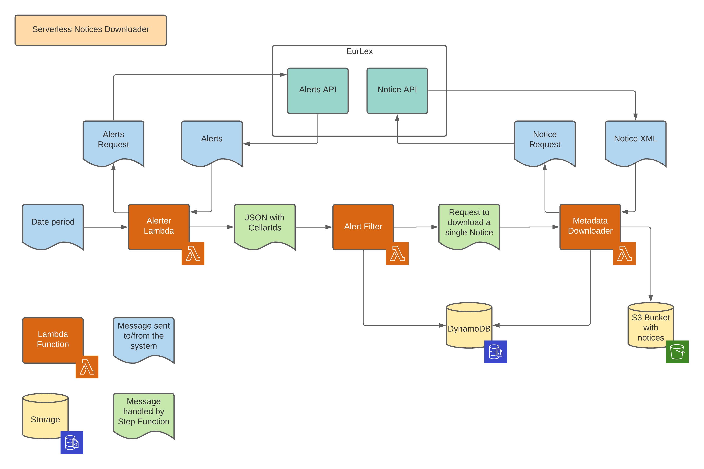
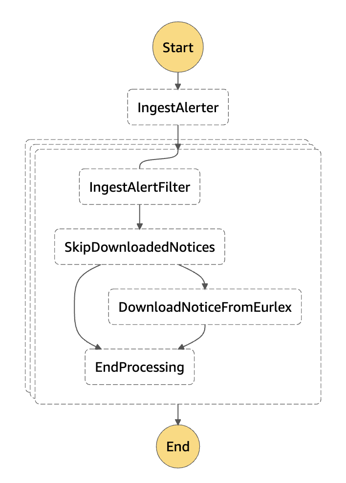

# AWS Serverless Architecture Model Example

## Top-level Overview

One the very top level this application allows downloading metadata legislation of the European
Union from the [EurLex website](https://eur-lex.europa.eu/). EurLex website provides the Cellar API
that allows sending REST requests and getting responses. For more information, please read
the [Cellar API documentation](https://op.europa.eu/en/publication-detail/-/publication/50ecce27-857e-11e8-ac6a-01aa75ed71a1/language-en/format-PDF/source-73059305)
.



On the very top-level, the application consists of three lambda functions:

* Ingest Alerter that is responsible for getting information about documents published within a
  given date period.
* Inget Alert Filter that filters out documents that have already been downloaded.
* Ingest Metadata Downloader which downloads Notice XML from the EurLex website and stores it to S3.

All these functions are orchestrated by the Step Function and the state machine described in
the `statemachine/eurlex_notice.asl.json` file.

Let's have a deep dive into the code.

## Ingest Alerter

Ingest Alerter is a simple app written in Java which gets updates from EurLex. The code is in 
`functions/ingest-alerter`.

**Input message format:**

```json
{
  "startDate": "2020-10-20",
  "endDate": "2020-10-21"
}
```

**Output message format:**

```json
{
  "items": [
    {
      "cellarId": "cellar1"
    },
    {
      "cellarId": "cellar2"
    }
  ]
}
```

## Ingest Alert Filter


**Input message format:**

```json
{
  "cellarId": "cellarId"
}
```

**Output message format:**

```json
{
  "cellarId": "cellarId",
  "exists": true
}
```

## Ingest Metadata Downloader

**Input message format:**

```json
{
  "cellarId": "cellarId",
  "exists": true
}
```

**Output message format:**

```json
{
  "cellarId": "cellarId",
  "exists": true,
  "downloaded": true
}
```

## Functions orchestration

Orchestration of lambda functions is performed by Step Functions and the state machine described in
the [eurlex_notice.asl.json](./statemachine/eurlex_notice.asl.json) file.

In common, it implements the following flow:



If you take a look into the State Machine definition you'll see that it doesn't have hardcoded
function names, instead it uses template params.

Example:

```json
"IngestAlerter": {
  "Comment": "Get updates from EurLex for particular date",
  "Type": "Task",
  "Resource": "arn:aws:states:::lambda:invoke",
  "Parameters": {
    "FunctionName": "${IngestAlerterArn}",
    "Payload.$": "$"
  },
  "Next": "CheckNoticesLoaded"
}
```

As you may see, this code has `${IngestAlerterArn}` value, actual value is supplied by the `sam`.

## Deployment

Deployment is performed by the Cloud Formation and template for it is also generated by the `sam`
using the [template.yaml](./template.yaml) file. In common, this file is a Cloud Formation template
which is additionally processed by the `sam` to simplify the deployment.

# Build and deploy locally

In order to build and deploy the application locally you should have the `sam` installed. These
links may be helpful:

* [What is SAM?](https://docs.aws.amazon.com/serverless-application-model/latest/developerguide/what-is-sam.html)
* [Installing SAM CLI](https://docs.aws.amazon.com/serverless-application-model/latest/developerguide/serverless-sam-cli-install.html)

When the `sam cli` is installed, use the following commands to build and deploy the aplication:

```shell
$ sam build --use-container
$ sam deploy --guided
```

In order to redeploy and existing application or make a change to the existing application you
anyway should rebuild and redeploy it:

```shell
$ sam build --use-container
$ sam deploy
```

# Running the application

To start the execution, execute a state machine with the message like this:

```json
{
  "startDate": "2020-10-20",
  "endDate": "2020-10-21"
}
```